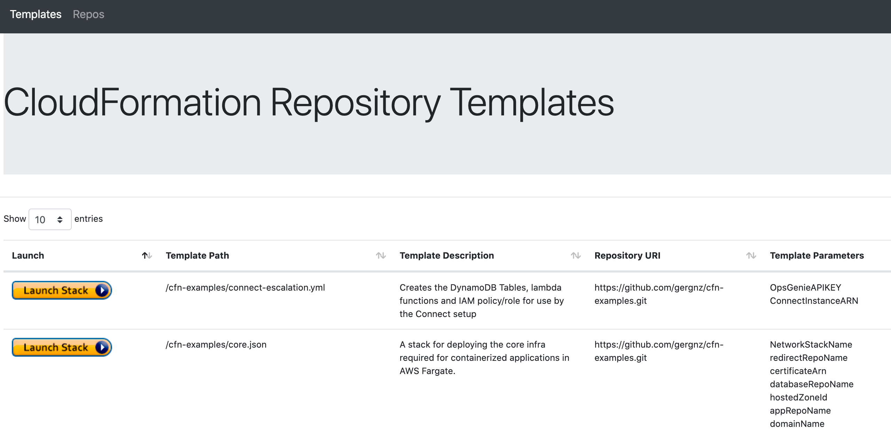
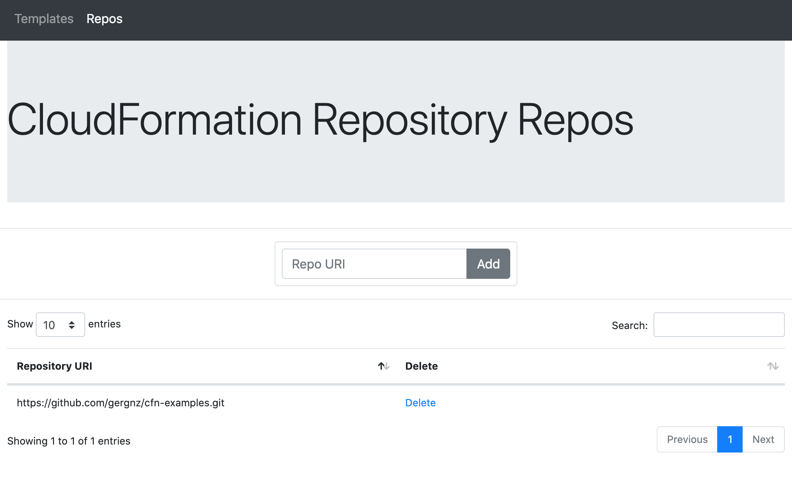
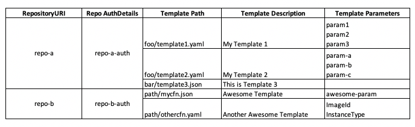

# CloudFormation Repository

CloudFormation Repository will load in a git repository and recursively read in all the files and then present them with their description, name, parameters and launch button so that you can launch the stack in your AWS Account.




## Disclaimer

If you deploy this into your AWS Account it will create resources that will cost you money. It's likely to be only a few dollars per month, but please take your own steps to ensure you understand the cost.

## Project Structure

* `cfrepo` - This has the CDK stack in it.
* `cloudformationrepo` - This has the application that is built into a container in it.

## CDK Development

The `cdk.json` file tells the CDK Toolkit how to execute your app.

### Setup
```
python -m venv .venv
source .venv/bin/activate
pip install -r requirements.txt
```

At this point you can now synthesize the CloudFormation template for this code.

```
$ cdk synth
```

To add additional dependencies, for example other CDK libraries, just add
them to your `setup.py` file and rerun the `pip install -r requirements.txt`
command.

### Useful commands

 * `cdk ls`          list all stacks in the app
 * `cdk synth`       emits the synthesized CloudFormation template
 * `cdk deploy`      deploy this stack to your default AWS account/region
 * `cdk diff`        compare deployed stack with current state
 * `cdk docs`        open CDK documentation


## Application Development

### Development Environment Setup
```
cd cloudformationrepo
docker image build -f dev-Dockerfile . -t cfrepodev:latest
```

```
cd cloudformationrepo
docker run -it -e AWS_PROFILE=my-profile \
-e DYNAMODB_TABLE=mydynamodb-table \
-e S3_BUCKET=mys3-bucket \
-p 5000:5000 -v $PWD:/srv -v ~/.aws:/root/.aws cfrepodev:latest
```

You can then browse to [http://localhost:5000/](http://localhost:5000/) on your desktop.

Editing the application code in `cloudformationrepo` will result in the Flask reloading.

Note: The flask development server is used in development while uwsgi is used in the _production_ container build.

### Data Structure


* Repository URI
  * Authentication details

* Metadata
  * Template Path
  * Template Description
  * Template Parameters

## Deployment

### Prerequisites
You need a route53 hosted public zone for this project to deploy successfully.

To deploy, you'll need to get the zoneid and the zone name.

### Bootstrap CDK

CDK requires bootstrapping as this project uses assets for the Docker container.

```
cdk bootstrap
```

### Application and Infrastructure Deployment

Deployment is then as simple as: 

```
ZONEID=abc1234 ZONENAME=example.com cdk deploy
```

Once deployment is completed, CloudFormation Repository will be available at a host called `cfrepo` on your domain.
